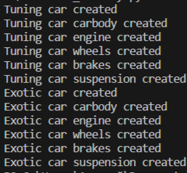

# OOP4    
    
## Исполнитель    
ФТ-220007 Фадеев Алексей    
    
## Задача    
Создайте пример реализации абстрактной фабрики, обсуждаемый на лекции):    
Или использование машин в игре Супер Ралли (тюниг -машина, экзотик-машина)    
Или использование для создания 2-х типов компьютеров (домашний,офисный)    
    
## Тесты    
Тест    
    
